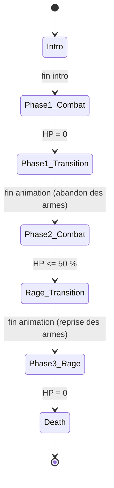

# Boss — State Machine (spécification technique)

> **Statut : SPÉCIFICATION UNIQUEMENT.** Aucun Blueprint modifié, aucun asset Unreal créé.
> Document produit après analyse du projet existant. En attente de validation avant implémentation.
>
> Date d'analyse : 30/08/2026 · Projet : `Francia_Souls_Like` (UE 5.8)

---

## 1. Analyse du projet existant

### 1.1 Acteurs identifiés

| Rôle | Asset | Classe parente | Remarques |
|---|---|---|---|
| **Joueur** | `/Game/Characters/Dark_Knight/Dark_Knight_Male/Blueprints/BP_DarkKnight_Alert` | `BP_ThirdPersonCharacter` | Hérite du pipeline Enhanced Input du template |
| **Ennemi standard** | `/Game/AI/BP_Enemy` | `Character` (nu) | Mesh Morigesh, `ABP_Morigesh` |
| **Boss** | `/Game/AI/BP_Boss` | `Character` (nu) | Mesh Khaimera ×2, `ABP_Khaimera` — **duplication de `BP_Enemy`** |

`BP_Boss` possède déjà : `CombatComponent` (`BPC_Combat_Khaimera_C`), `StatComponent`
(`BPC_Stat_Khaimera_C`), `HealthBarWidget`, et les overrides `ReceiveBeginPlay` / `ReceiveAnyDamage`.

### 1.2 Système de HP

Porté par **`BPC_Stat`** (`/Game/Characters/Dark_Knight/Dark_Knight_Male/Blueprints/BPC_Stat`,
ActorComponent). Composant **partagé** par le joueur, les ennemis et le boss.

Variables pertinentes : `MaxHealth`, `CurrentHealth`, `bIsDead`, `PendingDamage`, `PendingHeal`,
`DeathMontage`, `HitReactMontage`, `HitStunDuration`, `SavedMaxWalkSpeedHit`, `SavedMaxAccelHit`
(+ tout le bloc endurance : `MaxStamina`, `CurrentStamina`, `StaminaRegenPerSec`, etc.).

### 1.3 Système de dégâts

Pipeline **natif Unreal**, uniforme sur les trois personnages :

```
GameplayStatics::ApplyDamage(cible, montant, ...)
  --> Event AnyDamage (override sur BP_Boss / BP_Enemy / BP_DarkKnight_Alert)
        --> Set PendingDamage  (sur StatComponent)
        --> ApplyDamage        (Custom Event de BPC_Stat)
```

> **Contrainte d'outillage à connaître** : ce build ne dispose pas de `create_function`. Les
> « fonctions » de ce projet sont des **Custom Events**, et `add_function_parameter` échoue
> silencieusement sur eux. D'où le motif récurrent **variable porteuse + event sans paramètre**
> (`PendingDamage` puis `ApplyDamage`). Toute la conception ci-dessous respecte cette contrainte.

Côté source des dégâts : les AnimNotify `AttackDamage` posées sur les montages d'attaque appellent
`BPC_Combat.DoAttackTrace` (sphère sur le socket `hand_r`, rayon `AttackRadius`).

### 1.4 Système de mort — *point d'accroche central*

Flux réel relevé dans `BPC_Stat.ApplyDamage` :

```
ApplyDamage
 |- Branch (bIsDead ?) --- true --> (ignoré)
      |- false
         |- Set CurrentHealth = Clamp(CurrentHealth - PendingDamage, 0, MaxHealth)
            |- Branch (CurrentHealth <= 0 ?)
                 |- true  --> Set bIsDead = true --> PlayAnimMontage(DeathMontage)
                 |- false --> gel MaxWalkSpeed/MaxAcceleration --> PlayAnimMontage(HitReactMontage)
                              --> SetTimer(OnHitStunEnd, HitStunDuration)
```

**C'est exactement ici que la machine à états du boss doit s'insérer** : la branche
`CurrentHealth <= 0` ne doit pas mener systématiquement à la mort pour le boss.

### 1.5 Système d'IA

| Élément | Chemin |
|---|---|
| AIController | `/Game/AI/BP_AI_Enemy` (`AIController`, `PawnSensing` 2000 / 85°) |
| Behavior Tree | `/Game/AI/BT_Enemy` |
| Blackboard | `/Game/AI/BD_AI` — clés : `SelfActor` (Object), `seeingTarget?` (Bool), `targetActor` (Object) |
| Interface | `/Game/AI/BPI_Enemy` — `Attack01(Duration: double)` |

Structure de l'arbre :

```
ROOT
 └─ Selector
     ├─ Idle_Sequence      <décorateur Blackboard : seeingTarget? NotSet>
     └─ Chasing_Sequence   <décorateur Blackboard : seeingTarget? Set>
         ├─ Task_ChaseTarget   (AI MoveTo, AcceptanceRadius 220)
         ├─ Task_Attack        (appelle BPI_Enemy::Attack01)
         └─ Task_Strafe        (orbite rayon 250, pas 65°, sens aléatoire)
```

`BP_Boss` et `BP_Enemy` partagent **le même** controller, BT et blackboard.

### 1.6 State Machines existantes

**Aucune machine à états de gameplay.** Les AnimBP (`ABP_Khaimera`, `ABP_Morigesh`,
`ABP_DKM_Alert`) utilisent un Blend Space + slot `DefaultSlot`, **pas** de State Machine d'animation.

**Aucun `UserDefinedEnum` ni `UserDefinedStruct` dans tout le projet.** `EBossState` serait donc le
premier enum créé.

### 1.7 Composants réutilisables

| Composant | Réutilisable pour | Comment |
|---|---|---|
| `BPC_Stat` | HP, mort, hit-react | Déjà sur le boss (via `BPC_Stat_Khaimera`) |
| `BPC_Combat` | Attaques, trace de dégâts | Déjà sur le boss (via `BPC_Combat_Khaimera`) |
| `WBP_enemyHealthBar` | Barre de vie | Lit `CurrentHealth/MaxHealth` → **se remplit automatiquement** si on change `MaxHealth` |
| Motif `K2_SetTimer` + Custom Event | Séquencement des transitions | Utilisé partout (combo, hit-stun, régén) |
| Motif sous-classe dédiée | Config par personnage | `BPC_Stat_Khaimera` / `BPC_Combat_Khaimera` |

> **Piège d'outillage documenté dans le projet** : les *overrides d'instance* de composant ne
> survivent pas de façon fiable aux éditions de CDO. Les valeurs par personnage doivent être des
> **défauts de classe sur une sous-classe dédiée** — c'est déjà le motif employé
> (`BPC_Stat_Khaimera`). La config par phase suivra la même règle.

---

## 2. Conception

### 2.1 Progression voulue

```
Intro → Phase1_Combat → Phase1_Transition → Phase2_Combat → Rage_Transition → Phase3_Rage → Death
```

| Phase | Comportement | Condition de sortie |
|---|---|---|
| `Intro` | Boss inactif, IA gelée (cinématique d'entrée plus tard) | fin de l'intro (timer / notify) |
| `Phase1_Combat` | Attaques normales, **avec armes** | `CurrentHealth <= 0` |
| `Phase1_Transition` | Le boss **abandonne ses armes** (anim dédiée) | fin de l'animation |
| `Phase2_Combat` | **Nouvelle barre de vie**, utilise ses **pouvoirs** | `CurrentHealth <= 50 %` |
| `Rage_Transition` | Passage en rage (anim dédiée) | fin de l'animation |
| `Phase3_Rage` | **Reprend ses armes**, plus agressif | `CurrentHealth <= 0` |
| `Death` | Mort réelle | — |

### 2.2 Principe directeur

> Le boss ne « meurt » pas quand ses HP tombent à 0 : il **demande à sa machine à états** ce qu'il
> faut faire. Seule la Phase 3 autorise la mort réelle.

---

## 3. HP et dégâts par phase

### 3.1 Valeurs actuelles relevées (à conserver comme base)

**`BPC_Stat_Khaimera`** (défauts de classe) :

| Variable | Valeur actuelle |
|---|---|
| `MaxHealth` | **600** |
| `HitStunDuration` | 0.4 |
| `DeathMontage` | `AM_Khaimera_Death` |
| `HitReactMontage` | `AM_Khaimera_HitReact` |

**`BPC_Combat_Khaimera`** (défauts de classe) :

| Variable | Valeur actuelle |
|---|---|
| `AttackDamage` | **40** |
| `AttackRadius` | 180 |
| `AttackRange` | 190 |
| `AttackTraceDelay` | 0.25 |
| `HitStopScale` / `HitStopDuration` | 0.06 / 0.07 |
| `Montage1/2/3` | `AM_Khaimera_Attack_01/02/03` |
| `bCumulativeCombo` | `false` (3 montages distincts — correct pour le boss) |

`MaxWalkSpeed` du boss : **420**.

### 3.2 Configuration proposée

Les valeurs **Phase 1 reprennent l'existant** (600 HP / 40 dégâts) : elles sont déjà cohérentes
pour le prototype. **Les valeurs Phase 2 et Phase 3 ne sont pas décidées ici** — voir §7.

| Paramètre | Variable proposée | Phase 1 | Phase 2 | Phase 3 |
|---|---|---|---|---|
| Points de vie | `PhaseN_MaxHealth` | **600** *(existant)* | à définir | à définir |
| Dégâts d'attaque | `PhaseN_AttackDamage` | **40** *(existant)* | à définir | à définir |
| Vitesse | `PhaseN_MaxWalkSpeed` | **420** *(existant)* | à définir | à définir |
| Montages d'attaque | `PhaseN_Montage1/2/3` | `AM_Khaimera_Attack_01/02/03` | pouvoirs (à fournir) | armes reprises |
| Seuil de sortie | `PhaseN_ExitThreshold` | `0.0` (0 HP) | `0.5` (50 %) | `0.0` (0 HP) |

**Toutes ces variables sont des défauts de classe** sur le composant d'état (§4.2), donc éditables
dans les *Class Defaults* sans toucher au graphe.

### 3.3 Gestion des HP entre les phases

À l'entrée de chaque phase de combat, le composant d'état écrit sur `StatComponent` :

```
MaxHealth      = PhaseN_MaxHealth
CurrentHealth  = PhaseN_MaxHealth      // barre pleine
bIsDead        = false
```

La barre de vie (`WBP_enemyHealthBar`) lit `CurrentHealth / MaxHealth` à chaque tick :
**elle se remplit toute seule**, aucun câblage supplémentaire nécessaire.

---

## 4. Architecture proposée

### 4.1 Enumeration `EBossState`

Nouvel asset `UserDefinedEnum` : `/Game/AI/Boss/EBossState`

```
Intro
Phase1_Combat
Phase1_Transition
Phase2_Combat
Rage_Transition
Phase3_Rage
Death
```

Un enum est le bon choix ici : sept états mutuellement exclusifs, transitions linéaires,
lisibilité dans le debugger, et exploitable comme clé Blackboard. Une State Machine d'animation
serait inadaptée (c'est de la logique de gameplay, pas de la pose).

### 4.2 Où est stocké l'état

Nouveau composant **`BPC_BossState`** (ActorComponent), puis sous-classe
**`BPC_BossState_Khaimera`** portant les valeurs par phase — conformément au motif déjà en place.

Ce choix (plutôt que des variables directement sur `BP_Boss`) suit l'architecture existante
(`BPC_Stat` / `BPC_Combat`), garde `BP_Boss` lisible, et rend la machine réutilisable pour un
second boss.

**Variables principales :**

| Variable | Type | Rôle |
|---|---|---|
| `CurrentState` | `EBossState` | L'état courant — **source de vérité** |
| `PendingState` | `EBossState` | Variable porteuse (contrainte Custom Event sans paramètre) |
| `bTransitionLocked` | `bool` | Vrai pendant Intro et les transitions |
| `Phase1/2/3_MaxHealth` | `float` | cf. §3.2 |
| `Phase1/2/3_AttackDamage` | `float` | cf. §3.2 |
| `Phase1/2/3_MaxWalkSpeed` | `float` | cf. §3.2 |
| `Phase1/2/3_Montage1/2/3` | `AnimMontage` | cf. §3.2 |
| `IntroMontage`, `Phase1TransitionMontage`, `RageTransitionMontage` | `AnimMontage` | **laissées vides au départ** |
| `IntroDuration`, `Phase1TransitionDuration`, `RageTransitionDuration` | `float` | Repli si le montage est vide |

> **Propriété importante pour tester tôt** : `PlayAnimMontage(None)` ne fait rien et ne crashe pas
> (comportement déjà exploité pour le dodge du joueur). La machine est donc **entièrement testable
> avant que la moindre animation de transition n'existe** — les transitions durent simplement
> `PhaseNTransitionDuration`.

### 4.3 Comment un état est changé

Motif **variable porteuse + Custom Event**, imposé par l'outillage :

```
Set PendingState = <état voulu>
RequestState()                     // Custom Event de BPC_BossState
```

`RequestState` :
1. `CurrentState = PendingState`
2. `Switch on EBossState` → appelle l'event d'entrée correspondant
   (`EnterIntro`, `EnterPhase1`, `EnterPhase1Transition`, …)
3. Met à jour la clé Blackboard `bossBusy` (§4.5)

Chaque `EnterXxx` applique la config de sa phase (HP, dégâts, montages, vitesse) et, pour les
transitions, lance le montage + le timer de sortie.

### 4.4 Comment détecter les transitions

**Solution retenue : Event Dispatchers sur `BPC_Stat`** (`add_event_dispatcher` est disponible dans
ce build, contrairement à `create_function`).

Ajouts sur `BPC_Stat` (non destructifs, aucun impact sur le joueur qui ne s'y abonne pas) :

| Ajout | Type | Rôle |
|---|---|---|
| `bSuppressDeath` | `bool` (défaut `false`) | Si vrai, HP≤0 ne déclenche **pas** la mort |
| `OnHealthDepleted` | Event Dispatcher | Émis quand `CurrentHealth <= 0` |
| `OnHealthChanged` | Event Dispatcher | Émis après chaque application de dégâts |

Modification **minimale** de `ApplyDamage` : la branche `CurrentHealth <= 0` devient

```
Branch (CurrentHealth <= 0)
 |- true --> Branch (bSuppressDeath ?)
 |             |- true  --> OnHealthDepleted.Broadcast()      // le boss décide
 |             |- false --> Set bIsDead --> DeathMontage      // comportement actuel inchangé
 |- false --> hit-react (inchangé)
```

`BP_Boss.BeginPlay` met `bSuppressDeath = true` et s'abonne aux deux dispatchers.

**Détection par phase :**

| Phase | Signal | Test |
|---|---|---|
| `Phase1_Combat` | `OnHealthDepleted` | → `Phase1_Transition` |
| `Phase2_Combat` | `OnHealthChanged` | `CurrentHealth / MaxHealth <= 0.5` → `Rage_Transition` |
| `Phase3_Rage` | `OnHealthDepleted` | → `Death` (et `bSuppressDeath = false` pour laisser mourir) |

> Le seuil 50 % passe par `OnHealthChanged` plutôt que par un Tick : plus précis, sans coût par
> frame, et cohérent avec le reste du projet qui évite les Tick de gameplay.

### 4.5 Empêcher le boss d'attaquer pendant une transition

Trois verrous complémentaires :

1. **Blackboard** — nouvelle clé `bossBusy` (Bool) dans `BD_AI`. Décorateur Blackboard
   `bossBusy IsNotSet` sur `Chasing_Sequence`, avec `FlowAbortMode = Self` : dès que `bossBusy`
   passe à vrai, la séquence en cours est **avortée immédiatement**.
2. **Mouvement** — `AIController::StopMovement()` + gel `MaxWalkSpeed = 0` (motif déjà utilisé
   pendant les attaques et le hit-stun, avec restauration).
3. **Montage** — `Montage_Stop(0.15)` pour couper une attaque en cours, puis lecture du montage de
   transition.

`bossBusy` est piloté par `bTransitionLocked`, positionné dans `RequestState`.

> `BT_Enemy` étant **partagé avec `BP_Enemy`**, la clé `bossBusy` restera simplement à `false` pour
> les ennemis normaux : aucun impact sur eux.

### 4.6 Déclencher les animations / cinématiques plus tard

Chaque état de transition suit le même squelette :

```
EnterXxxTransition:
   bTransitionLocked = true          -> bossBusy = true (BT avorte)
   StopMovement + gel du déplacement
   Montage_Stop(attaque en cours)
   Duration = PlayAnimMontage(XxxMontage)        // 0 si le montage est vide
   SetTimer(OnXxxTransitionEnd, max(Duration, XxxDuration))

OnXxxTransitionEnd:
   PendingState = <phase suivante> ; RequestState()
```

Point d'extension : le jour où une **cinématique (Level Sequence)** remplace le montage, seul le
corps de `EnterXxxTransition` change — la machine et les timers restent identiques.

### 4.7 Modifier les paramètres de combat selon la phase

`EnterPhaseN` écrit sur les composants existants :

| Cible | Écriture |
|---|---|
| `StatComponent.MaxHealth` / `CurrentHealth` | `PhaseN_MaxHealth` |
| `CombatComponent.AttackDamage` | `PhaseN_AttackDamage` |
| `CombatComponent.Montage1/2/3` | `PhaseN_Montage1/2/3` |
| `CharacterMovement.MaxWalkSpeed` | `PhaseN_MaxWalkSpeed` |

> **Attention outillage** : écrire une propriété d'un composant **natif** (`CharacterMovement`)
> depuis un autre Blueprint nécessite le spawner dédié
> (`discover_nodes("Set Max Walk Speed")` → `SPAWN K2Node_VariableSet|Set Max Walk Speed`) — le
> `variable_set` générique produit un nœud sans pin `self`. Piège déjà rencontré et documenté.

---

## 5. Machine à états



Vue linéaire :

```
        Intro
          |  fin intro
          v
    Phase1_Combat        armes · HP = Phase1_MaxHealth
          |  HP = 0
          v
  Phase1_Transition      IA gelée · abandon des armes
          |  fin anim
          v
    Phase2_Combat        pouvoirs · HP = Phase2_MaxHealth (barre neuve)
          |  HP <= 50 %
          v
   Rage_Transition       IA gelée · reprise des armes
          |  fin anim
          v
    Phase3_Rage          agressif · paramètres renforcés
          |  HP = 0
          v
         Death           bSuppressDeath = false -> mort réelle
```

**Invariants**

- Une seule transition active à la fois ; `bTransitionLocked` interdit toute ré-entrée.
- Les états `*_Transition` et `Intro` impliquent `bossBusy = true`, donc le BT n'exécute ni
  poursuite, ni attaque, ni strafe.
- La mort réelle n'est possible que depuis `Phase3_Rage`.

---

## 6. Plan d'implémentation

Chaque étape est **indépendante, compilable, testable et validable** avant la suivante.

### Étape 1 — Enum et composant d'état (squelette)
Créer `EBossState`, `BPC_BossState` + sous-classe `BPC_BossState_Khaimera`, avec `CurrentState`,
`PendingState`, `bTransitionLocked` et les variables de config (§3.2), renseignées avec les
**valeurs actuelles pour la Phase 1**. Ajouter le composant à `BP_Boss`.
**Test :** le boss se comporte exactement comme aujourd'hui ; `CurrentState` lisible en PIE.

### Étape 2 — Logique de changement d'état
Implémenter `RequestState` (Switch sur `EBossState`) et les sept events d'entrée, **vides** hormis
un `Print String`.
**Test :** forcer chaque état depuis Python (`comp.call_method("RequestState")`) et vérifier que le
bon event se déclenche.

### Étape 3 — Verrou de transition (IA)
Ajouter la clé `bossBusy` à `BD_AI`, le décorateur `IsNotSet` (`FlowAbortMode = Self`) sur
`Chasing_Sequence`, et le gel mouvement/montage.
**Test :** forcer `bossBusy = true` en PIE → le boss s'arrête net et n'attaque plus ; à `false`,
il reprend.

### Étape 4 — Hooks HP sur `BPC_Stat`
Ajouter `bSuppressDeath`, `OnHealthDepleted`, `OnHealthChanged` et modifier la branche de mort.
**Test de non-régression prioritaire :** le **joueur** et `BP_Enemy` meurent toujours normalement
(`bSuppressDeath = false` par défaut). Puis : boss avec `bSuppressDeath = true` → HP à 0 sans mourir.

### Étape 5 — Phase 1 + Intro
`EnterIntro` (verrou + timer) puis `EnterPhase1` (applique HP/dégâts/montages/vitesse Phase 1).
Abonnement à `OnHealthDepleted` dans `BeginPlay`.
**Test :** au spawn, intro puis combat normal ; à 0 HP le boss **ne meurt pas** et passe en
`Phase1_Transition`.

### Étape 6 — Transition 1 vers Phase 2
`EnterPhase1Transition` (montage éventuellement vide + timer) puis `EnterPhase2` (nouvelle barre de
vie, montages « pouvoirs »).
**Test :** barre de vie **repleine** à l'entrée en Phase 2 ; boss inattaquable pendant la transition.

### Étape 7 — Seuil 50 % et Rage
Abonnement à `OnHealthChanged`, test `<= Phase2_ExitThreshold` puis `Rage_Transition` et
`Phase3_Rage` (reprise des armes, paramètres renforcés).
**Test :** infliger des dégâts jusqu'à 50 % exactement → la rage se déclenche **une seule fois**.

### Étape 8 — Death
Depuis `Phase3_Rage`, `OnHealthDepleted` mène à `EnterDeath` : `bSuppressDeath = false`,
`bIsDead = true`, `DeathMontage`, désactivation de l'IA et de la collision.
**Test :** le boss meurt réellement et reste mort.

### Étape 9 — Passe d'intégration
Cycle complet en PIE (Intro → … → Death), vérification des seuils, des verrous, de la barre de vie,
et **non-régression joueur / ennemi standard**. Commentaires (`add_comment_around_nodes`) +
`auto_layout_graph` sur les graphes créés.

**Total : 9 étapes.**

---

## 7. Points nécessitant une décision

| # | Sujet | Pourquoi je ne tranche pas |
|---|---|---|
| 1 | **HP Phase 2 et Phase 3** | Équilibrage pur. Phase 1 = 600 (existant) conservé. |
| 2 | **Dégâts Phase 2 et Phase 3** | Idem. Phase 1 = 40 (existant) conservé. |
| 3 | **Montages « pouvoirs » Phase 2** | Aucune animation de pouvoir n'existe dans le projet (seulement `AM_Khaimera_Attack_01/02/03`). Réutiliser les mêmes en attendant, ou fournir de nouvelles anims ? |
| 4 | **Phase 3 « plus agressif »** | À préciser : vitesse ↑, dégâts ↑, cooldown d'attaque ↓, plus de strafe ? |
| 5 | **Durée / contenu de l'Intro** | Simple timer, montage, ou Level Sequence ? |
| 6 | **Config : variables plates ou `UserDefinedStruct`** | Variables plates = robuste avec l'outillage actuel mais verbeux. Un struct `FBossPhaseConfig` + tableau serait plus élégant, mais l'édition de structs par script est peu fiable dans ce build. **Recommandation : variables plates pour le prototype.** |
| 7 | **BT partagé ou dédié au boss** | Actuellement `BT_Enemy` est partagé. Les phases pourraient à terme exiger un BT dédié (`BT_Boss`). **Recommandation : rester sur le BT partagé** tant que les pouvoirs ne demandent pas de branches spécifiques. |

---

## 8. Risques identifiés

| Risque | Mitigation |
|---|---|
| Modifier `BPC_Stat` impacte joueur + ennemis | `bSuppressDeath` par défaut `false` donc comportement strictement inchangé. Non-régression testée à l'étape 4. |
| `OnHealthChanged` déclenche la rage plusieurs fois | Garde sur `CurrentState == Phase2_Combat` dans le handler. |
| Overrides d'instance perdus | Toute config par phase en **défauts de classe** sur `BPC_BossState_Khaimera`. |
| Dégâts reçus pendant une transition | `bTransitionLocked` peut aussi servir d'invulnérabilité — **à confirmer** (point de design). |
| Écriture sur `CharacterMovement` depuis un autre BP | Utiliser le spawner dédié `SPAWN K2Node_VariableSet\|Set Max Walk Speed` (piège documenté). |
