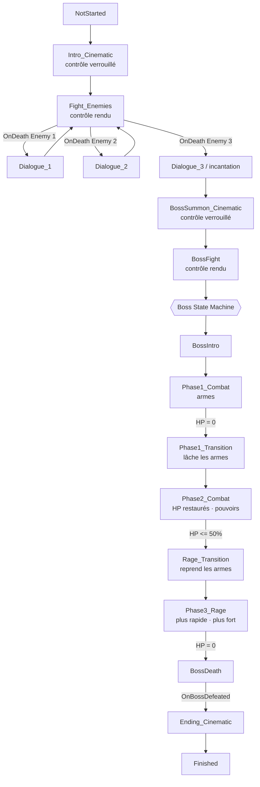

# Combat Flow — Architecture du combat scénarisé complet

> **Statut : SPÉCIFICATION UNIQUEMENT.** Aucun Blueprint modifié, aucun asset Unreal créé.
> En attente de validation avant toute implémentation.
>
> Date d'analyse : 30/08/2026 · Projet : `Francia_Souls_Like` (UE 5.8)
>
> Ce document **remplace et absorbe** `Docs/Boss_StateMachine.md` (la machine du boss y est
> reprise en §8, replacée dans l'architecture globale).

---

## 1. État actuel du projet

### 1.1 Acteurs

| Rôle | Asset | Parent | HP actuels |
|---|---|---|---|
| Joueur | `/Game/Characters/.../BP_DarkKnight_Alert` | `BP_ThirdPersonCharacter` | **100** |
| Ennemi | `/Game/AI/BP_Enemy` (mesh Morigesh) | `Character` nu | **100** |
| Boss | `/Game/AI/BP_Boss` (mesh Khaimera ×2) | `Character` nu | **600** |

GameMode : `BP_ThirdPersonGameMode` (`GameModeBase`), `DefaultPawnClass = BP_DarkKnight_Alert_C`.

### 1.2 Contenu réel du niveau `Lvl_ThirdPerson`

| Acteur | Nombre | Position |
|---|---|---|
| `PlayerStart` | 1 | (0, 0, 302) |
| `BP_Enemy_C` | **1** | (340, −1290, 88) |
| `BP_Boss_C` | **1** | (600, 0, 400) |
| `BP_ThirdPersonCharacter_C` | 1 | (360, −1080, 90) — Manny résiduel du template |
| `NavMeshBoundsVolume` | 2 | (0,0,0) et (−300,−510,−10) |

> **Il n'y a qu'un seul ennemi placé.** Le combat en demande trois.

### 1.3 Ce qui n'existe pas du tout

| Système | État | Conséquence |
|---|---|---|
| **Level Sequence** | **0 dans le projet** | Aucune cinématique existante |
| **DataTable / DataAsset** | **0** | Aucune config data-driven |
| **UserDefinedEnum / Struct** | **0** | `ECombatFlowState` et `EBossState` seraient les premiers |
| **Système de dialogue** | Aucun | À concevoir (même minimal) |
| **Verrouillage du contrôle joueur** | Aucun | À ajouter |
| **Combat Flow / orchestrateur** | Aucun | Cœur de ce document |

### 1.4 🔴 Lacune structurante : la mort ne fait rien

Vérifié sur `BP_Enemy`, `BP_Boss` **et** `BP_AI_Enemy` : **aucune référence** à `Death`, `StopLogic`,
`Unpossess`, `StopMovement`, `Destroy` ou `SetLifeSpan`.

Aujourd'hui, à la mort d'un ennemi :

```
CurrentHealth <= 0  ->  bIsDead = true  ->  PlayAnimMontage(DeathMontage)
```

…et **c'est tout**. Le Behavior Tree continue de tourner, l'ennemi continue de poursuivre, de
straf­er et d'attaquer, sa collision reste active. Aucun événement n'est émis.

De plus, `BPC_Stat` ne possède **aucun Event Dispatcher** (fonctions présentes : `ApplyDamage`,
`Heal`, `RegenTick`, `ConsumeAttackStamina`, `ConsumeDodgeStamina`, `EndRegenPause`, `OnHitStunEnd`).

> **Conséquence directe :** rien ne peut actuellement réagir à une mort. C'est le **prérequis
> n°1** de tout le Combat Flow, et l'objet de l'Étape 1 du plan.

---

## 2. Systèmes existants réutilisables

| Système | Chemin | Réutilisé pour |
|---|---|---|
| `BPC_Stat` | `.../Blueprints/BPC_Stat` | HP, mort, hit-react, endurance — **partagé joueur/ennemis/boss** |
| `BPC_Combat` | `.../Blueprints/BPC_Combat` | Combos, trace de dégâts, dodge |
| Sous-classes dédiées | `BPC_Stat_Khaimera`, `BPC_Combat_Morigesh`… | **Motif de config par personnage** |
| `BP_AI_Enemy` + `BT_Enemy` + `BD_AI` | `/Game/AI/` | IA (poursuite, attaque, strafe) — **partagée boss/ennemi** |
| `BPI_Enemy` | `/Game/AI/BPI_Enemy` | `Attack01(Duration)` |
| `WBP_enemyHealthBar` | `/Game/CoreSystems/.../ExampleEnemy/` | Barre de vie — lit `CurrentHealth/MaxHealth` |
| `WBP_HUD` | `/Game/UI/WBP_HUD` | HUD joueur (vie + endurance) |
| Motif `K2_SetTimer` + Custom Event | partout | Séquencement des transitions |

### 2.1 Contraintes d'outillage à respecter (héritées du projet)

1. **Pas de `create_function`** dans ce build. Tout est en **Custom Events**, et
   `add_function_parameter` échoue silencieusement sur eux → motif **variable porteuse + event**
   (comme `PendingDamage` puis `ApplyDamage`).
2. **Les overrides d'instance de composant ne persistent pas** de façon fiable → la config par
   personnage/phase doit être en **défauts de classe sur une sous-classe dédiée**.
3. **`add_event_dispatcher` est disponible** → c'est le mécanisme retenu pour signaler les morts.
4. **Écrire une propriété d'un composant natif** (`CharacterMovement`) depuis un autre BP exige le
   spawner dédié (`SPAWN K2Node_VariableSet|Set Max Walk Speed`).

---

## 3. Architecture proposée

Trois niveaux **strictement séparés** :

```
┌──────────────────────────────────────────────────────────┐
│  COMBAT FLOW   (BP_CombatDirector, placé dans le niveau) │
│  « Où en est le SCÉNARIO ? »                             │
│  Intro > 3 ennemis > dialogues > invocation > boss > fin  │
└───────────┬──────────────────────────────┬───────────────┘
            │ écoute OnDeath               │ écoute OnBossDefeated
            ▼                              ▼
┌───────────────────────┐      ┌───────────────────────────┐
│  ENEMY  (BP_Enemy)    │      │  BOSS  (BP_Boss)          │
│  combat + OnDeath     │      │  BPC_BossState            │
│  ne connaît PAS le    │      │  « Dans quelle PHASE ? »  │
│  scénario             │      │  ne connaît PAS le        │
└───────────────────────┘      │  scénario                 │
                               └───────────────────────────┘
            │                              │
            └──────────────┬───────────────┘
                           ▼
              ┌────────────────────────────┐
              │ CINEMATICS / DIALOGUES     │
              │ déclenchés PAR les events  │
              │ ne contiennent AUCUNE      │
              │ logique de gameplay        │
              └────────────────────────────┘
```

**Règle de dépendance : les flèches ne remontent jamais.** Un ennemi ignore l'existence du Combat
Flow ; il se contente d'émettre `OnDeath`. Le boss ignore le scénario ; il gère ses phases. C'est
le Combat Flow qui écoute et orchestre.

---

## 4. Combat Flow

### 4.1 Support : `BP_CombatDirector`

Un **Actor placé dans le niveau** (et non le GameMode) :

- il référence directement les acteurs du niveau (les 3 ennemis, le boss, les volumes) ;
- il est propre à cette rencontre — une autre arène aura son propre director ;
- il reste inspectable en PIE (état visible dans le Details panel) ;
- il n'impose rien au GameMode, déjà utilisé par le template.

> Alternative écartée : mettre la logique dans le GameMode/GameState. Cela rendrait le scénario
> global au jeu alors qu'il est propre à **une** rencontre, et compliquerait le référencement des
> acteurs placés.

### 4.2 Enum `ECombatFlowState`

```
NotStarted
Intro_Cinematic
Fight_Enemies
Dialogue_1
Dialogue_2
Dialogue_3
BossSummon_Cinematic
BossFight
Ending_Cinematic
Finished
```

### 4.3 Variables principales

| Variable | Type | Rôle |
|---|---|---|
| `CurrentFlowState` | `ECombatFlowState` | Source de vérité du scénario |
| `PendingFlowState` | `ECombatFlowState` | Variable porteuse (contrainte Custom Event) |
| `Enemies` | `Array<Actor>` *(instance editable)* | **Les 3 ennemis, dans l'ordre**, désignés dans le niveau |
| `BossActor` | `Actor` *(instance editable)* | Le boss |
| `EnemiesDefeated` | `int` | Compteur de contrôle |
| `IntroSequence`, `SummonSequence`, `EndingSequence` | `LevelSequence` | **Laissées vides au départ** |
| `Dialogue1/2/3_Lines` | `Array<Text>` | Contenu des dialogues |
| `bPlayerControlLocked` | `bool` | État du verrou |

### 4.4 Changement d'état

Même motif que le reste du projet :

```
Set PendingFlowState = <état>
RequestFlowState()            // Custom Event
   -> CurrentFlowState = PendingFlowState
   -> Switch on ECombatFlowState -> EnterXxx()
```

### 4.5 Verrouillage du contrôle joueur

Deux events sur le director :

```
LockPlayerControl()    : DisableInput(PlayerController) + StopMovement + bPlayerControlLocked = true
UnlockPlayerControl()  : EnableInput(PlayerController)  + bPlayerControlLocked = false
```

`DisableInput` neutralise Enhanced Input d'un bloc — attaque, dodge et déplacement compris — sans
toucher aux graphes d'input existants de `BP_DarkKnight_Alert`.

---

## 5. Gestion des trois ennemis

### 5.1 Identification individuelle — solution retenue

> Exigence : *« Le système doit savoir quel ennemi a été vaincu »*, pas seulement combien.

**Le director détient un tableau ordonné `Enemies` (3 entrées) renseigné dans le niveau.**
Au `BeginPlay`, il s'abonne au `OnDeath` du `StatComponent` de chacun. Quand un `OnDeath` arrive,
il retrouve **l'index** de l'acteur mort dans le tableau → identité exacte (0 = Enemy 1, etc.).

Avantages :
- l'identité vit **côté director**, là où le scénario est défini ;
- aucune variable à poser sur chaque ennemi (donc aucun risque lié au piège des overrides
  d'instance de composant) ;
- réordonner le combat = réordonner un tableau, sans toucher aux Blueprints.

> Le dispatcher `OnDeath` doit transporter l'acteur mort en paramètre
> (`add_event_dispatcher_parameter` est disponible), sinon le handler ne peut pas savoir qui a
> émis. C'est le seul endroit où un paramètre est indispensable — et les **dispatchers**
> l'autorisent, contrairement aux Custom Events.

**Alternative** (si tu préfères) : une variable `EnemyIndex` (int, instance editable) sur
`BP_Enemy`, réglée sur chaque instance dans le niveau. Plus lisible dans l'éditeur, mais déplace
la définition du scénario dans les acteurs. — *à arbitrer, cf. §15.*

### 5.2 Enchaînement

```
Fight_Enemies
   OnDeath(index 0) -> Dialogue_1 -> retour Fight_Enemies
   OnDeath(index 1) -> Dialogue_2 -> retour Fight_Enemies
   OnDeath(index 2) -> Dialogue_3 -> BossSummon_Cinematic
```

Le troisième est traité à part : il ne rend pas la main au combat, il enchaîne sur l'invocation.

### 5.3 Ce qu'il faut ajouter à l'ennemi (minimal)

1. `OnDeath` (dispatcher sur `BPC_Stat`, avec l'acteur en paramètre) ;
2. **arrêt réel à la mort** : `StopLogic` du Behavior Tree, `StopMovement`, collision désactivée,
   `bIsDead` déjà géré. *(cf. §1.4 — aujourd'hui un ennemi mort continue de se battre.)*
3. Placer **2 ennemis supplémentaires** dans le niveau.

---

## 6. Gestion des dialogues

Aucun système n'existe. Proposition **volontairement minimale**, conçue pour être remplacée :

| Élément | Proposition |
|---|---|
| Affichage | `WBP_Dialogue` — une boîte de texte + nom du locuteur, ajoutée au viewport |
| Contenu | `Array<Text>` sur le director (une entrée = une réplique) |
| Avance | Timer par réplique (`DialogueLineDuration`) **ou** input de validation |
| Déclenchement | `PlayDialogue()` + variable porteuse `PendingDialogueIndex` |
| Fin | Event `OnDialogueFinished` → le director avance dans le flow |

**Point d'architecture :** le director ne fait qu'appeler `PlayDialogue` et attendre
`OnDialogueFinished`. Le jour où tu branches un vrai système (DataTable de répliques, voix,
sous-titres), **seul le widget change** — le flow reste identique.

**Null-safe :** si le tableau de répliques est vide, `PlayDialogue` termine immédiatement. Le
combat est donc jouable de bout en bout **avant** que le moindre dialogue soit écrit.

---

## 7. Gestion de l'invocation du boss

```
Mort Enemy 3
  -> Dialogue_3 (réaction)
  -> LockPlayerControl()
  -> (optionnel) montage d'incantation sur Enemy 3
  -> BossSummon_Cinematic :
        si SummonSequence valide -> Play + attendre OnFinished
        sinon                    -> timer SummonFallbackDuration
  -> Boss activé : BossActor.SetActorHiddenInGame(false), IA démarrée,
                   BPC_BossState.RequestState(BossIntro)
  -> UnlockPlayerControl()
  -> CurrentFlowState = BossFight
```

Le boss est **présent dans le niveau mais désactivé** au départ (caché, IA arrêtée, collision off)
plutôt que spawné dynamiquement : plus simple à placer, à régler et à déboguer.

> **Aucune dépendance rigide à une cinématique** : `SummonSequence` peut rester vide. Le flow
> passe alors par un simple timer et reste entièrement testable.

---

## 8. Boss State Machine

Séparée du Combat Flow — elle ne répond qu'à la question *« dans quelle phase est le boss ? »*.

### 8.1 Enum `EBossState`

```
BossIntro
Phase1_Combat
Phase1_Transition
Phase2_Combat
Rage_Transition
Phase3_Rage
BossDeath
```

### 8.2 Support : `BPC_BossState` (+ `BPC_BossState_Khaimera`)

Composant sur `BP_Boss`, sous-classe dédiée portant la config — conformément au motif
`BPC_Stat_Khaimera` déjà en place (seul moyen fiable de persister des valeurs par personnage).

| Variable | Type | Rôle |
|---|---|---|
| `CurrentState` / `PendingState` | `EBossState` | État + porteuse |
| `bTransitionLocked` | `bool` | Vrai pendant Intro et transitions |
| `Phase1/2/3_MaxHealth` | `float` | HP par phase |
| `Phase1/2/3_AttackDamage` | `float` | Dégâts par phase |
| `Phase1/2/3_AttackRate` | `float` | Cadence (`InPlayRate` des montages) |
| `Phase1/2/3_MaxWalkSpeed` | `float` | Vitesse par phase |
| `Phase1/2/3_Montage1/2/3` | `AnimMontage` | Attaques par phase |
| `Phase2_RageThreshold` | `float` | Défaut `0.5` |
| `IntroMontage`, `Phase1TransitionMontage`, `RageTransitionMontage` | `AnimMontage` | **Vides au départ** |
| `IntroDuration`, `Phase1TransitionDuration`, `RageTransitionDuration` | `float` | Repli si montage vide |
| `OnBossDefeated` | Dispatcher | Écouté par le Combat Flow |

> `PlayAnimMontage(None)` ne fait rien et ne crashe pas (comportement déjà exploité pour le dodge).
> **La machine est donc testable de bout en bout avant qu'aucune animation de transition n'existe.**

### 8.3 Détection des transitions

Via les dispatchers ajoutés à `BPC_Stat` (§9.2) :

| Phase | Signal | Test | Cible |
|---|---|---|---|
| `Phase1_Combat` | `OnHealthDepleted` | — | `Phase1_Transition` |
| `Phase2_Combat` | `OnHealthChanged` | `Current/Max <= Phase2_RageThreshold` | `Rage_Transition` |
| `Phase3_Rage` | `OnHealthDepleted` | — | `BossDeath` |

Garde obligatoire : le handler de rage ne déclenche que si `CurrentState == Phase2_Combat`
(sinon `OnHealthChanged` la relancerait à chaque coup suivant).

---

## 9. Gestion HP / Damage

### 9.1 Existant — à conserver

Le pipeline est propre et uniforme, **il n'y a aucune raison de le remplacer** :

```
GameplayStatics::ApplyDamage(cible, montant)
  -> Event AnyDamage (override sur les 3 personnages)
     -> Set PendingDamage (StatComponent)
     -> ApplyDamage (Custom Event BPC_Stat)
        -> Clamp(CurrentHealth - PendingDamage, 0, MaxHealth)
        -> si <= 0 : bIsDead + DeathMontage
        -> sinon   : gel déplacement + HitReactMontage + timer OnHitStunEnd
```

Source des dégâts : AnimNotify `AttackDamage` → `BPC_Combat.DoAttackTrace` (sphère sur `hand_r`,
rayon `AttackRadius`, montant `AttackDamage`).

**Valeurs actuelles conservées comme base :**

| Acteur | MaxHealth | AttackDamage |
|---|---|---|
| Joueur | 100 | 12 (stamina) / dégâts d'arme |
| Ennemi (Morigesh) | 100 | 25 |
| Boss (Khaimera) | **600** | **40** |

Boss : `AttackRadius` 180, `AttackRange` 190, `MaxWalkSpeed` 420, `bCumulativeCombo = false`.

### 9.2 Ajouts nécessaires à `BPC_Stat` (non destructifs)

| Ajout | Type | Rôle |
|---|---|---|
| `bSuppressDeath` | `bool` (défaut **`false`**) | Si vrai, HP≤0 ne tue pas |
| `OnHealthDepleted` | Dispatcher | HP arrivés à 0 |
| `OnHealthChanged` | Dispatcher | Après chaque dégât (seuil 50 %) |
| `OnDeath` | Dispatcher *(param : Actor)* | Mort effective — écouté par le Combat Flow |

Modification **minimale** de la branche de mort :

```
Branch (CurrentHealth <= 0)
 |- true --> Branch (bSuppressDeath ?)
 |             |- true  --> OnHealthDepleted.Broadcast()     // le boss décide
 |             |- false --> Set bIsDead --> DeathMontage
 |                          --> OnDeath.Broadcast(owner)     // NOUVEAU
 |- false --> hit-react (inchangé) + OnHealthChanged.Broadcast()
```

> **`bSuppressDeath` vaut `false` par défaut** ⇒ le joueur et les ennemis conservent exactement le
> comportement actuel. Seul `BP_Boss` le met à `true`. Non-régression testée en priorité.

### 9.3 HP entre les phases du boss

À l'entrée de `PhaseN_Combat` :

```
StatComponent.MaxHealth     = PhaseN_MaxHealth
StatComponent.CurrentHealth = PhaseN_MaxHealth
StatComponent.bIsDead       = false
```

`WBP_enemyHealthBar` lisant `CurrentHealth / MaxHealth`, **la barre se remplit toute seule**.

### 9.4 Paramètres de combat par phase

`EnterPhaseN` écrit sur les composants existants :

| Cible | Source |
|---|---|
| `CombatComponent.AttackDamage` | `PhaseN_AttackDamage` |
| `CombatComponent.Montage1/2/3` | `PhaseN_Montage1/2/3` |
| `InPlayRate` des Play Montage | `PhaseN_AttackRate` |
| `CharacterMovement.MaxWalkSpeed` | `PhaseN_MaxWalkSpeed` |

---

## 10. Gestion des transitions

### 10.1 Squelette commun (boss)

```
EnterXxxTransition:
   bTransitionLocked = true          -> bossBusy = true (le BT avorte)
   StopMovement + MaxWalkSpeed = 0
   Montage_Stop(0.15)                 // coupe l'attaque en cours
   Duration = PlayAnimMontage(XxxMontage)      // 0 si vide
   SetTimer(OnXxxTransitionEnd, max(Duration, XxxDuration))

OnXxxTransitionEnd:
   restaurer MaxWalkSpeed
   PendingState = <phase suivante> ; RequestState()
```

### 10.2 Empêcher le boss d'attaquer pendant une transition

Trois verrous complémentaires :

1. **Blackboard** — nouvelle clé `bossBusy` (Bool) dans `BD_AI` + décorateur `IsNotSet` sur
   `Chasing_Sequence` avec **`FlowAbortMode = Self`** ⇒ la séquence en cours est avortée
   immédiatement, pas à la fin de la tâche.
2. **Mouvement** — `StopMovement()` + `MaxWalkSpeed = 0` (motif déjà utilisé pour l'attaque et le
   hit-stun, avec restauration).
3. **Montage** — `Montage_Stop` sur l'attaque en cours.

> `BT_Enemy` est **partagé** avec `BP_Enemy` : `bossBusy` restera `false` pour les ennemis
> normaux, aucun impact sur eux.

### 10.3 Transitions du Combat Flow

Même principe au niveau scénario : `LockPlayerControl()` avant toute cinématique/dialogue,
`UnlockPlayerControl()` après.

---

## 11. Gestion des cinématiques

**Aucune Level Sequence n'existe aujourd'hui.** L'architecture est conçue pour que ce soit sans
conséquence :

| Slot | Variable | Si vide |
|---|---|---|
| Intro de la rencontre | `IntroSequence` | timer `IntroFallbackDuration` |
| Invocation du boss | `SummonSequence` | timer `SummonFallbackDuration` |
| Fin du combat | `EndingSequence` | timer `EndingFallbackDuration` |

Motif unique :

```
PlayCinematic(Sequence, FallbackDuration):
   si Sequence valide :
        CreateLevelSequencePlayer -> Play -> bind OnFinished -> OnCinematicFinished()
   sinon :
        SetTimer(OnCinematicFinished, FallbackDuration)
```

**Règle d'or respectée :** la cinématique ne contient aucune logique de combat. Elle est *jouée
par* le flow et *rend la main* au flow. Remplacer un timer par une vraie séquence ne touche
qu'une variable.

---

## 12. Diagramme global



Vue linéaire demandée :

```
INTRO
 v
RENCONTRE DES 3 ENNEMIS
 v
DIALOGUE
 v
COMBAT
 v
ENNEMI 1 MORT  ->  DIALOGUE  ->  retour combat
 v
ENNEMI 2 MORT  ->  DIALOGUE  ->  retour combat
 v
ENNEMI 3 MORT  ->  DIALOGUE / INCANTATION
 v
CINEMATIQUE INVOCATION
 v
BOSS INTRO
 v
BOSS PHASE 1          armes
 v  HP = 0
TRANSITION            lâche les armes
 v
BOSS PHASE 2          HP RESTAURES · pouvoirs
 v  HP = 50 %
RAGE                  reprend les armes
 v
BOSS PHASE 3          plus rapide
 v  HP = 0
MORT
 v
CINEMATIQUE FINALE
 v
FIN
```

---

## 13. Plan d'implémentation

Chaque étape : **implémentation → compilation → test → rapport → validation → étape suivante.**

### Étape 0 — Compatibilité de squelette *(prérequis aux nouvelles anims)*
`add_compatible_skeleton(SK_Mannequin)` sur `Morigesh_Skeleton` et `Khaimera_Skeleton`.
**Test :** jouer `AS_LevitatingUnconscious` sur une Morigesh et `AS_FireballSpell` sur le boss ;
**valider visuellement** l'absence de déformation (sinon → IK Retargeter, §17.1).

### Étape 1 — Fondation : signaler et gérer la mort ⚠️ *prérequis absolu*
Ajouter à `BPC_Stat` : `OnDeath` (param Actor), `OnHealthDepleted`, `OnHealthChanged`,
`bSuppressDeath`. Câbler l'arrêt réel à la mort (`StopLogic` du BT, `StopMovement`, collision off).
**Test :** un ennemi tué **cesse** de bouger et d'attaquer (aujourd'hui il continue) ; le joueur
meurt toujours normalement.

### Étape 2 — Peupler le niveau + pose de mort maintenue
Placer les 2 ennemis manquants, retirer le `BP_ThirdPersonCharacter` résiduel, désactiver le boss
au départ (caché, IA off), poser un **volume de trigger provisoire**.
Passer `AM_Morigesh_Death` en **`bEnableAutoBlendOut = false`** (§17.2) — l'anim de base est
conservée, seul le blend-out est neutralisé.
**Test :** 3 ennemis actifs ; une Morigesh tuée joue sa mort et **reste au sol** (aujourd'hui elle
se relèverait en Idle au bout d'1 s).

### Étape 3 — Squelette du Combat Flow
`ECombatFlowState`, `BP_CombatDirector`, `RequestFlowState`, `Lock/UnlockPlayerControl`, tableau
`Enemies`, abonnements aux `OnDeath`.
**Test :** l'état affiché change ; tuer un ennemi est bien détecté **avec son index**.

### Étape 4 — Enchaînement des 3 ennemis (sans dialogue)
`Fight_Enemies` → `Dialogue_N` (vides, timer 0) → retour au combat ; le 3e enchaîne sur
l'invocation.
**Test :** tuer les 3 dans le désordre ; vérifier que chaque mort déclenche **son** étape.

### Étape 5 — Dialogues
`WBP_Dialogue`, `PlayDialogue`, `OnDialogueFinished`, verrouillage du contrôle pendant.
**Test :** 3 dialogues distincts, contrôle rendu après chacun.

### Étape 6 — Lévitation collective + invocation du boss (sans cinématique)
Après la 3e mort : **timer de 5 s**, puis le director joue `AS_LevitatingUnconscious`
**simultanément** sur les 3 Morigesh (+ montée par Timeline si option B retenue, §17.3), puis
`BossSummon_Cinematic` avec timer de repli, activation du boss, `BossIntro`.
**Test :** les 3 corps restent 5 s au sol, puis la lévitation se déclenche **sur les trois en même
temps** ; le boss s'active ensuite et le combat démarre.

### Étape 7 — Boss State Machine (squelette)
`EBossState`, `BPC_BossState` + `BPC_BossState_Khaimera`, `RequestState`, events d'entrée vides,
clé `bossBusy` + décorateur `FlowAbortMode = Self`.
**Test :** forcer chaque état ; vérifier que `bossBusy` gèle réellement l'IA.

### Étape 8 — Phase 1 → Transition → Phase 2
`bSuppressDeath = true` sur le boss, `EnterPhase1`, `EnterPhase1Transition`, `EnterPhase2`.
**Test :** à 0 HP le boss **ne meurt pas**, transition jouée, **barre repleine** en Phase 2.

### Étape 8bis — Système de projectile (fireball) 🔧 *seul nouveau système*
Créer `BP_Fireball` (`ProjectileMovementComponent` + `SphereComponent` + Niagara du pack), dégâts
à l'impact via `ApplyDamage`, spawn depuis un AnimNotify sur le montage de cast. Monter les
montages fireball depuis `AS_FireballSpell` / `AS_SpellAndCastFireball` (§17.4).
**Test :** le boss lance un projectile visible qui inflige des dégâts au joueur ; pas de dégât si
le projectile rate.

### Étape 9 — Rage → Phase 3
Seuil 50 % via `OnHealthChanged` (avec garde), `Rage_Transition`, `Phase3_Rage` : reprise des
armes + **cadence ×1.5** (`InPlayRate` 1.5, `MaxWalkSpeed` 630 à confirmer).
**Test :** la rage se déclenche **une seule fois**, exactement à 50 % ; le boss est visiblement
plus rapide ensuite.

### Étape 10 — Mort du boss + fin
`BossDeath` (IA off, attaques off, montage), `OnBossDefeated` → `Ending_Cinematic` → `Finished`.
**Test :** cycle complet sans blocage.

### Étape 11 — Branchement des Level Sequences
Créer les 3 séquences et les assigner aux variables, en remplacement des timers.
**Test :** chaque cinématique rend bien la main.

### Étape 12 — Équilibrage
HP, dégâts, cadences, seuils.

**Total : 14 étapes** (0, 1-8, 8bis, 9-12). Étapes 0-6 = Combat Flow jouable ; 7-10 = boss ;
11-12 = finition. **L'étape 8bis est le seul nouveau système** ; tout le reste réutilise
l'existant.

---

## 14. Plan de tests

| Étape | Test de validation | Non-régression |
|---|---|---|
| 1 | Ennemi mort → immobile, n'attaque plus | Joueur et ennemis meurent normalement |
| 2 | 3 ennemis actifs, boss inactif | Le joueur spawne et se bat |
| 3 | Index correct de l'ennemi tué | — |
| 4 | Ordre de mort quelconque → bon dialogue | Le combat reste jouable |
| 5 | Contrôle verrouillé/rendu | Aucun input perdu après déverrouillage |
| 6 | Boss activé au bon moment | — |
| 7 | `bossBusy` gèle l'IA | Ennemis normaux non affectés |
| 8 | Barre repleine en Phase 2 | Le boss ne meurt pas en Phase 1 |
| 9 | Rage une seule fois à 50 % | Pas de re-déclenchement |
| 10 | Boss mort définitivement | — |
| 11 | Cinématiques rendent la main | Flow identique sans séquence |
| 12 | Difficulté cohérente | — |

**Méthodes de test disponibles** (déjà éprouvées sur ce projet) : lecture directe des composants en
PIE, `GameplayStatics.apply_damage()` pour forcer les seuils, `set_global_time_dilation` pour
observer les transitions, captures d'écran.

---

## 15. Décisions — état

### 15.1 Tranchées (30/08, validées par l'utilisateur)

| # | Sujet | Décision |
|---|---|---|
| 2 | Les 3 ennemis | **Trois Morigesh identiques** (`BP_Enemy`) |
| 3 | HP Phase 2 / 3 du boss | **Identiques à la Phase 1** (600) |
| 4 | Dégâts Phase 2 / 3 | **Identiques à la Phase 1** (40) |
| 5 | Pouvoirs Phase 2 | **Cast magique de fireball** (pack `CombatMagicAnims` + `Mixed_Magic_VFX_Pack`) |
| — | Phase 3 | Reprise des armes **+ 1.5× plus rapide** |
| — | Mort d'une Morigesh | **Animation de base conservée** (`AM_Morigesh_Death`), pose maintenue |
| — | Après les 3 morts | **Attente 5 s**, puis `AS_LevitatingUnconscious` sur les 3 en simultané |
| 7 | Déclenchement de l'intro | **Franchissement d'un point sur la carte** (couloir → grande salle, niveau à construire) |
| — | Cinématiques / narration | **Reportées** — on les branche une fois le combat fonctionnel |
| — | Principe de déclenchement | Tout est piloté par **position du joueur + état des ennemis** |

> Détail technique de chacune de ces décisions : **§17**.

### 15.2 Encore ouvertes

| # | Sujet | Options |
|---|---|---|
| 1 | **Identité des ennemis** | (a) **Tableau ordonné sur le director** *(recommandé)* — (b) variable `EnemyIndex` par instance |
| 6 | **Contenu des dialogues** | Textes à fournir ; avance par timer ou par input ? |
| 8 | **Invulnérabilité pendant les transitions du boss** | Souhaitée ou non ? |
| 9 | **Boss caché ou spawné** | Recommandé : présent mais désactivé |
| 10 | **BT partagé ou `BT_Boss` dédié** | Recommandé : rester partagé |
| 11 | **Manny résiduel** (`BP_ThirdPersonCharacter` à 360,−1080) | Le supprimer du niveau ? |
| 12 | **Lévitation : montée physique ?** | cf. §17.3 — l'anim ne soulève pas le personnage (pelvis constant à 89) |
| 13 | **Retargeting : compatible skeleton ou IK Retargeter ?** | cf. §17.1 — je peux faire le premier par script, pas le second |
| 14 | **Les corps restent-ils en lévitation ?** | Si oui, `bEnableAutoBlendOut = false` aussi sur ce montage (§17.3) |

---

## 16. Risques identifiés

| Risque | Mitigation |
|---|---|
| Modifier `BPC_Stat` impacte joueur + ennemis + boss | `bSuppressDeath` défaut `false` ⇒ comportement inchangé ; non-régression en Étape 1 |
| `OnHealthChanged` relance la rage à chaque coup | Garde `CurrentState == Phase2_Combat` |
| Overrides d'instance perdus | Config en **défauts de classe** sur sous-classes dédiées |
| BT partagé boss/ennemi | `bossBusy` reste `false` pour les ennemis |
| Ennemi mort qui continue d'agir | **Traité en Étape 1** — c'est la lacune actuelle |
| Cinématiques inexistantes bloquant le dev | Tous les slots sont null-safe avec timer de repli |
| `DisableInput` laissant un input coincé | Vérifier le déverrouillage après chaque dialogue (test Étape 5) |
| **Anims magiques sur `SK_Mannequin`** | 16/16 os concordent → `add_compatible_skeleton` ; repli IK Retargeter si déformation (§17.1) |
| **Pose de rituel qui ne tient pas** | Désactiver `bEnableAutoBlendOut` sur le montage (§17.2) |
| **`BP_Magma_Shot_Projectile` est purement visuel** | Un vrai projectile de gameplay est à créer (§17.4) |

---

## 17. Décisions validées — impact technique

*(Analyse des assets ajoutés par l'utilisateur, 30/08.)*

Nouveaux dossiers détectés : `/Game/CombatMagicAnims` (164), `/Game/Mixed_Magic_VFX_Pack` (166),
`/Game/Gothic_Environment` (28), `/Game/MedCastle` (1365), `/Game/RuinedCrypt` (726).

### 17.1 🔴 Les anims magiques sont sur `SK_Mannequin` — point de vigilance n°1

| Squelette | Os |
|---|---|
| `SK_Mannequin` (toutes les anims `AS_*`) | **161** |
| `Morigesh_Skeleton` | 195 |
| `Khaimera_Skeleton` | 206 |

**Test de concordance effectué** sur 16 os structurants (`root`, `pelvis`, `spine_01/02/03`,
`clavicle_l`, `upperarm_l`, `lowerarm_l`, `hand_l/r`, `neck_01`, `head`, `thigh_l`, `calf_l`,
`foot_l`, `ball_l`) :

> **16/16 présents sur Morigesh ET sur Khaimera.**

⇒ `SkeletonService.add_compatible_skeleton(SK_Mannequin)` devrait fonctionner, exactement comme
pour le Dark Knight (précédent déjà validé dans ce projet).

**Réserve honnête :** des noms d'os identiques ne garantissent pas des **proportions** identiques.
Le squelette compatible partage les données d'animation *sans retargeting*. Khaimera (mis à
l'échelle ×2, morphologie massive) et Morigesh (silhouette élancée) n'ont pas les proportions du
Mannequin : un léger décalage visuel est possible. Deux options :

| Option | Coût | Qualité |
|---|---|---|
| **`add_compatible_skeleton`** *(recommandé d'abord)* | Immédiat | Bonne si les proportions sont proches — **à valider à l'œil** |
| **IK Retargeter** (UE5) | Plus long, génère de nouvelles AnimSequences | Propre, corrige les proportions |

*Recommandation : tenter le compatible skeleton, et ne construire un retargeter que si le rendu
est visiblement déformé.*

### 17.2 Mort des Morigesh — animation de base, pose maintenue

**Décision : on conserve l'animation de mort existante** (`AM_Morigesh_Death`, montée depuis les
anims Paragon). Aucun nouveau montage de mort n'est nécessaire — `AS_KneelingRitualAscend` est
écarté.

**Mais un correctif reste indispensable.** État relevé :

```
AM_Morigesh_Death : len = 1.00 s
                    enable_auto_blend_out  = True      <-- problème
                    blend_out_trigger_time = -1.0
                    blendIn / blendOut     = 0.25 / 0.25
```

Avec `enable_auto_blend_out = True`, le montage re-blende vers le Blend Space de locomotion au
bout d'une seconde : **la Morigesh morte se relèverait en Idle**. Pour figer la pose de mort :

```
AM_Morigesh_Death :
    bEnableAutoBlendOut = false      <-- la dernière frame est maintenue
    BlendOut.BlendTime  = 0
```

C'est le mécanisme natif UE pour tenir un montage sur sa dernière pose. S'y ajoute (Étape 1) :
arrêt du Behavior Tree, `StopMovement`, collision désactivée.

> Ce point vaut aussi pour le boss (`AM_Khaimera_Death`) — à vérifier au moment de l'Étape 10.

### 17.3 Séquence collective après la 3e mort

**Décision :**

```
mort de la 3e Morigesh
   -> attendre 5 s          (les 3 restent dans leur pose de mort)
   -> jouer AS_LevitatingUnconscious sur les 3 simultanément
   -> enchaîner sur l'invocation du boss
```

Propriétés relevées de `AS_LevitatingUnconscious` :

| Propriété | Valeur |
|---|---|
| Durée | **6.20 s** |
| Squelette | `SK_Mannequin` *(cf. §17.1)* |
| `enable_root_motion` | `false` |
| Déplacement racine | (0, 0, **+0.6**) — négligeable |
| Hauteur du pelvis | **89 → 89.2 → 89** (constante) |

> ⚠️ **L'animation ne fait pas léviter le personnage.** Le pelvis reste à hauteur debout standard
> sur toute la durée : c'est une **posture** de corps inconscient, pas une élévation. Si tu veux
> qu'elles décollent réellement du sol, la montée doit être pilotée par le gameplay.

| Option | Description |
|---|---|
| **A — Posture seule** | Les 3 jouent l'anim au sol. Le plus simple. |
| **B — Montée par Timeline** *(recommandé si tu veux la lévitation)* | Le director interpole leur `ActorLocation` vers le haut pendant les 6.2 s. Contrôle total, aucun asset requis. |
| **C — Level Sequence** | Mouvement animé dans le Sequencer. Plus expressif, dépend d'un asset à créer. |

**« Animation collective » = simple synchronisation.** Le director lance `AS_LevitatingUnconscious`
sur les 3 Morigesh dans la même frame ; aucun système spécial n'est nécessaire.

**Note d'enchaînement :** l'anim de lévitation devra elle aussi tenir sa pose finale
(`bEnableAutoBlendOut = false`) si les corps doivent rester ainsi pendant le combat de boss.
Sinon elles retomberaient en Idle debout au bout de 6.2 s.

### 17.4 🔴 Phase 2 du boss — le fireball est un système à créer

`BP_Magma_Shot_Projectile` existe déjà (`/Game/Mixed_Magic_VFX_Pack/Blueprint/`) mais son contenu
réel est : parent `Actor`, composants `StaticMesh` + `Niagara`, une variable `Looped`, et un seul
`Event BeginPlay`.

> **Aucun `ProjectileMovementComponent`, aucune collision, aucun dégât.** C'est une vitrine VFX,
> pas un projectile de gameplay.

Or le système de combat actuel (`BPC_Combat.DoAttackTrace`) est une **sphère de trace mêlée sur
`hand_r`** — inadapté à une attaque à distance.

**Ce que la Phase 2 exige réellement (nouveau) :**

| Élément | À créer |
|---|---|
| `BP_Fireball` | `Actor` + `ProjectileMovementComponent` + `SphereComponent` + Niagara du pack |
| Dégâts | `OnComponentHit/BeginOverlap` → `ApplyDamage` → réutilise le pipeline existant |
| Déclenchement | AnimNotify sur le montage de cast → `SpawnActor` depuis un socket de main |
| Anims disponibles | `AS_FireballSpell` (3.9 s), `AS_SpellAndCastFireball` (5.4 s), `AS_FireballCharge` (1.97 s), `AS_CastSpell` (4.8 s) |
| VFX disponibles | `NS_Magma_Shot_Projectile`, `NS_Dark_Solo_Projectile` |

**C'est le seul vrai ajout de système du projet** — le reste réutilise l'existant. Il justifie une
étape d'implémentation dédiée (Étape 8bis, §13).

### 17.5 Configuration du boss — simplifiée par tes décisions

HP et dégâts identiques sur les trois phases ⇒ la config par phase se réduit à :

| Paramètre | Phase 1 | Phase 2 | Phase 3 |
|---|---|---|---|
| `MaxHealth` | 600 | 600 | 600 |
| `AttackDamage` | 40 | 40 (fireball) | 40 |
| `AttackRate` | 1.0 | 1.0 | **1.5** |
| `MaxWalkSpeed` | 420 | 420 | **630** *(420 × 1.5 — à confirmer)* |
| Montages | `AM_Khaimera_Attack_01/02/03` | montages fireball | `AM_Khaimera_Attack_01/02/03` |
| Mode d'attaque | mêlée (trace) | **projectile** | mêlée (trace) |

> Les variables par phase restent en place malgré des valeurs identiques : elles rendent
> l'équilibrage possible sans retoucher le graphe (Étape 12).
>
> **Question ouverte :** « 1.5× plus rapide » = cadence d'animation seule, ou aussi vitesse de
> déplacement ? J'ai proposé les deux ci-dessus, à confirmer.

### 17.6 Déclenchement par position — architecture

Ton principe (« démarrer chaque cinématique/dialogue selon la position du joueur et l'état des
ennemis ») est déjà celui du document : le **Combat Flow** est précisément la couche qui observe
ces deux signaux et décide. Concrètement :

| Déclencheur | Mécanisme |
|---|---|
| Entrée dans la salle | `BP_CombatDirector` expose un `BoxComponent` (ou référence un `TriggerVolume` du niveau) → `OnComponentBeginOverlap` filtré sur le pawn joueur → `Intro_Cinematic` |
| État des ennemis | Abonnements `OnDeath` (§5) |
| Phases du boss | Dispatchers HP (§8.3) |

Le niveau (couloir → salle) n'existant pas encore, l'Étape 2 place un volume **provisoire** dans
`Lvl_ThirdPerson` pour rendre le flow testable immédiatement ; il sera repositionné une fois
l'arène construite avec `MedCastle` / `RuinedCrypt` / `Gothic_Environment`.
